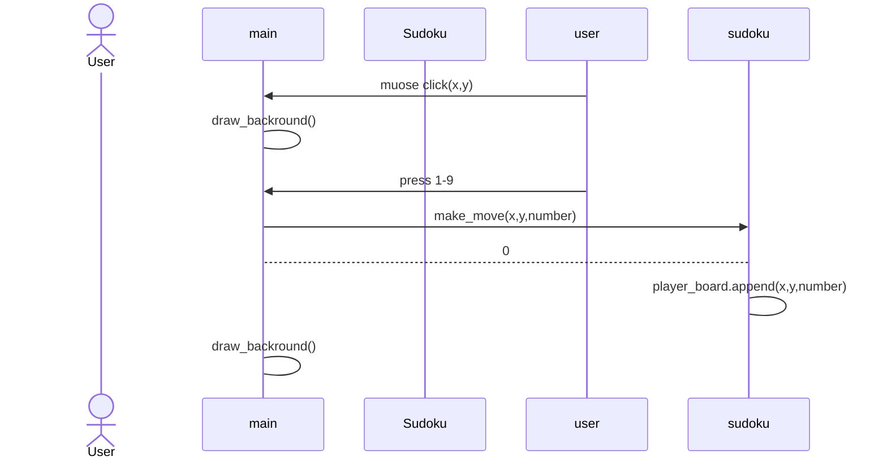

# Arkkitehtuuri

## Käyttöliittymä

Käyttöliittymä on tehty pygamella ja siinä on yksi näkymä. Näkymä toimii main luokassa ja sen funktionaalisuus tulee sudoku luokasta. Näkymä muuttuu sen mukaan mitä käyttäjä valitsee ruudukosta ja lisää numeroita ruudukkoon.

## Päätoiminnallisuus

Numeron lisääminen:

