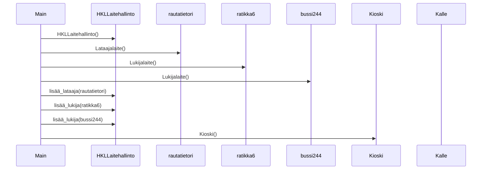

```mermaid
sequenceDiagram
    participant M as Main
    participant H as HKLLaitehallinto
    M ->> H: HKLLaitehallinto()
    participant R as rautatietori
    M ->> R: Lataajalaite()
    participant R6 as ratikka6
    M ->> R6: Lukijalaite()
    participant B as bussi244
    M ->> B: Lukijalaite()
    M ->> H: lisää_lataaja(rautatietori)
    M ->> H: lisää_lukija(ratikka6)
    M ->> H: lisää_lukija(bussi244)
    participant K as Kioski
    M ->> K: Kioski()
    participant Ka as Kalle
    
    
```
