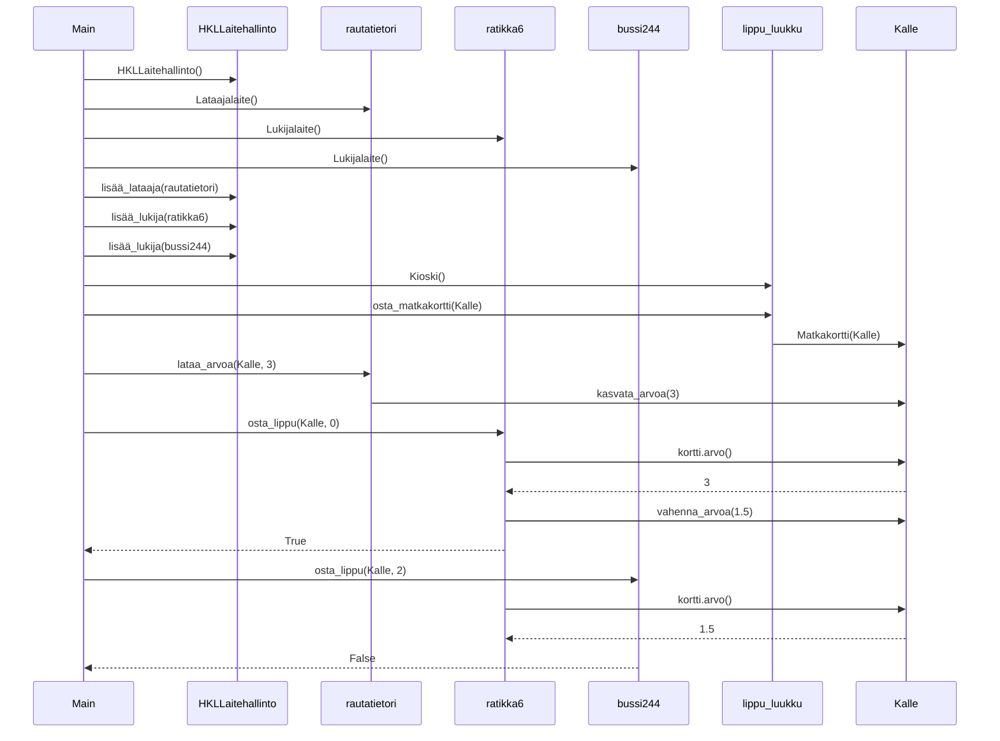

```mermaid
sequenceDiagram
    participant M as Main
    participant H as HKLLaitehallinto
    M ->> H: HKLLaitehallinto()
    participant R as rautatietori
    M ->> R: Lataajalaite()
    participant R6 as ratikka6
    M ->> R6: Lukijalaite()
    participant B as bussi244
    M ->> B: Lukijalaite()
    M ->> H: lisää_lataaja(rautatietori)
    M ->> H: lisää_lukija(ratikka6)
    M ->> H: lisää_lukija(bussi244)
    participant L as lippu_luukku
    M ->> L: Kioski()
    participant K as Kalle
    M ->> L: osta_matkakortti(Kalle)
    L ->> K: Matkakortti(Kalle)
    M ->> R: lataa_arvoa(Kalle, 3)
    R ->> K: kasvata_arvoa(3)
    M ->> R6: osta_lippu(Kalle, 0)
    R6 ->> K: kortti.arvo()
    K -->> R6: 3
    R6 ->> K: vahenna_arvoa(1.5)
    R6 -->> M: True
    M ->> B: osta_lippu(Kalle, 2)
    R6 ->> K: kortti.arvo()
    K -->> R6: 1.5
    B -->> M: False
```
