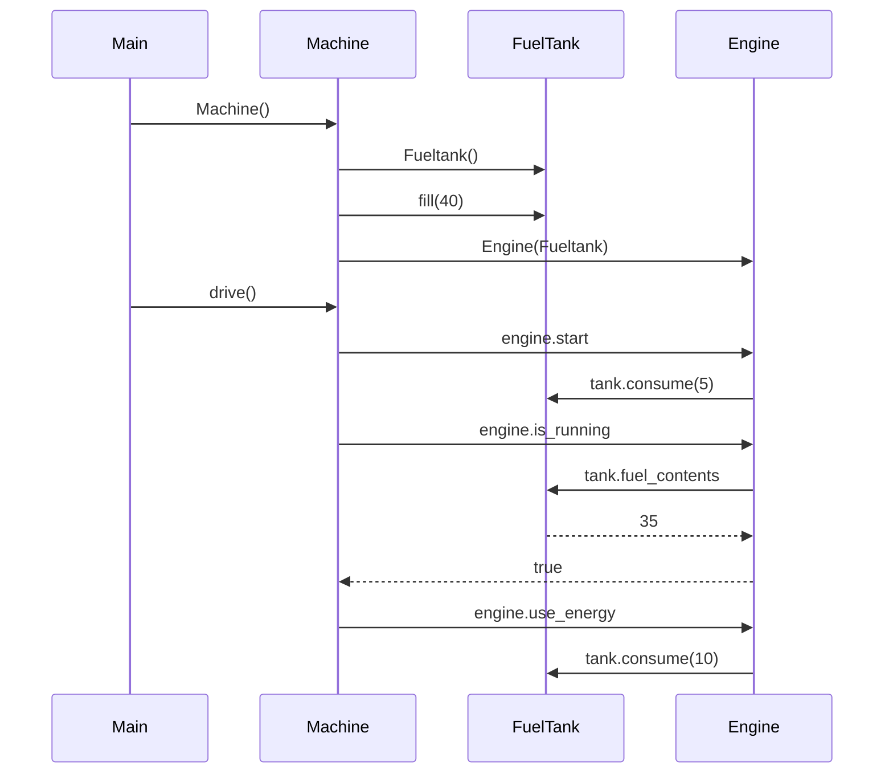

```mermaid
sequenceDiagram
   participant X as Main
   participant M as Machine
   participant F as FuelTank
   participant E as Engine
   X ->> M: Machine()
   M ->> F: Fueltank()
   M ->> F: fill(40)
   M ->> E: Engine(Fueltank)
   X ->> M: drive()
   M ->> E: engine.start
   E ->> F: tank.consume(5)
   M ->> E: engine.is_running
   E ->> F: tank.fuel_contents
   F -->> E: 35
   E -->> M: true
   M ->> E: engine.use_energy
   E ->> F: tank.consume(10)
```
