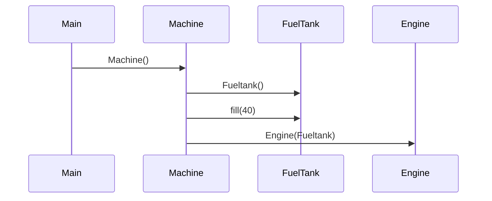

```mermaid
sequenceDiagram
   participant X as Main
   participant M as Machine
   participant F as FuelTank
   participant E as Engine
   X ->> M: Machine()
   M ->> F: Fueltank()
   M ->> F: fill(40)
   M ->> E: Engine(Fueltank)
   
```
