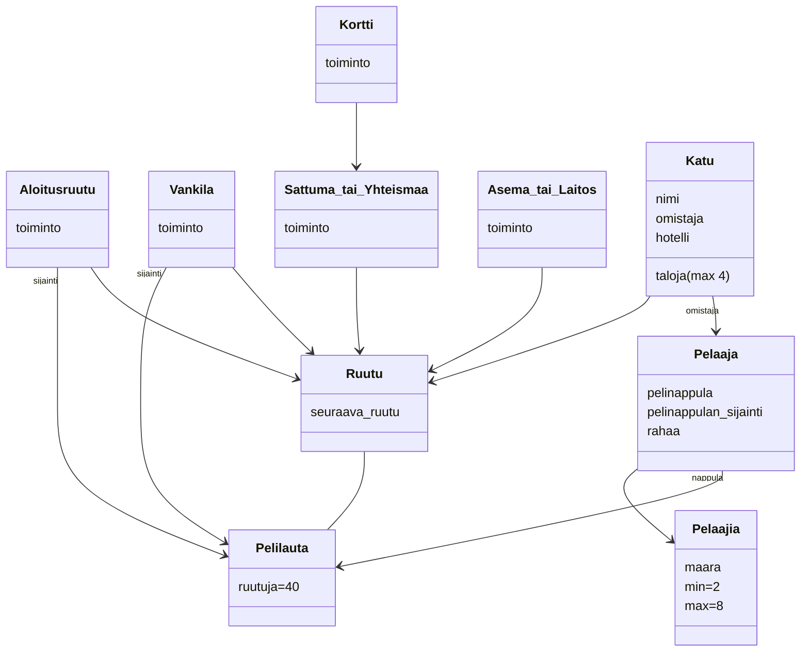

```mermaid
 classDiagram
      Pelaaja --> Pelaajia
      Ruutu -- Pelilauta
      Pelaaja "nappula" --> Pelilauta
      Aloitusruutu "sijainti" --> Pelilauta
      Vankila "sijainti" --> Pelilauta
      Aloitusruutu --> Ruutu
      Vankila --> Ruutu
      Sattuma_tai_Yhteismaa --> Ruutu
      Asema_tai_Laitos --> Ruutu
      Katu --> Ruutu
      Katu "omistaja" --> Pelaaja
      Kortti --> Sattuma_tai_Yhteismaa
      class Pelaajia{
          maara
	  min=2
	  max=8
      }
      class Pelilauta{
          ruutuja=40
      }
      class Ruutu{
          seuraava_ruutu 
      }
      class Pelaaja{
          pelinappula
	  pelinappulan_sijainti
	  rahaa
      }
      class Aloitusruutu{
          toiminto
      }
      class Vankila{
          toiminto
      }
      class Sattuma_tai_Yhteismaa{
          toiminto
      }
      class Asema_tai_Laitos{
          toiminto
      }
      class Katu{
          nimi
          omistaja
	  taloja (max 4)
	  hotelli
      }
      class Kortti{
          toiminto
      }
```
