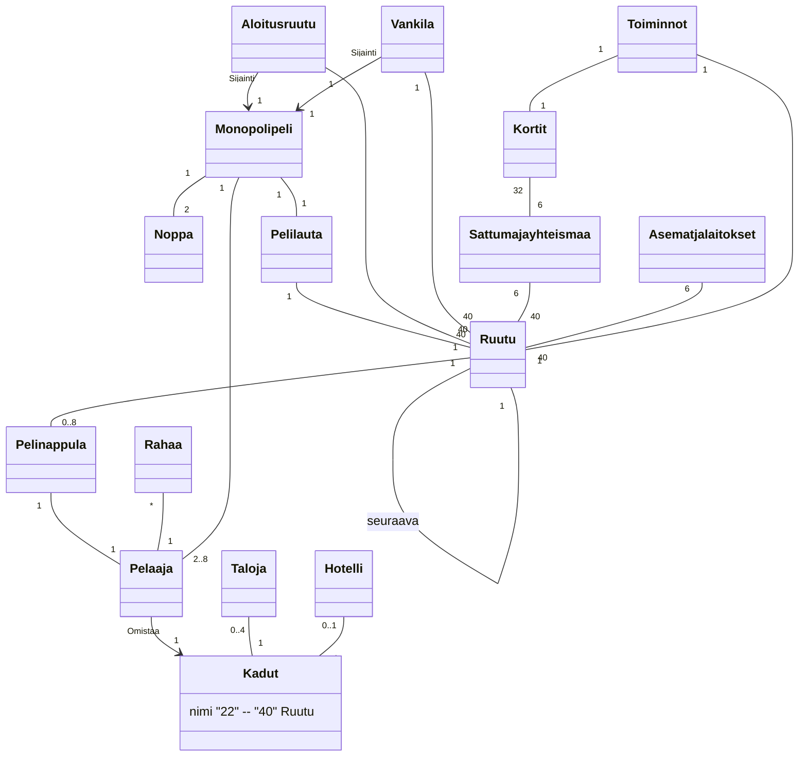

## Monopoli, alustava luokkakaavio

```mermaid
 classDiagram
    Monopolipeli "1" -- "2" Noppa
    Monopolipeli "1" -- "1" Pelilauta
    Pelilauta "1" -- "40" Ruutu
    Ruutu "1" -- "1" Ruutu : seuraava
    Ruutu "1" -- "0..8" Pelinappula
    Pelinappula "1" -- "1" Pelaaja
    Pelaaja "2..8" -- "1" Monopolipeli
    Aloitusruutu "1" -- "40" Ruutu
    Aloitusruutu "Sijainti" --> "1" Monopolipeli
    Vankila "1" -- "40" Ruutu
    Vankila "Sijainti" --> "1" Monopolipeli
    Sattuma ja yhteismaa "6" -- "40" Ruutu
    Asemat ja laitokset "6" -- "40" Ruutu
    Kadut:nimi "22" -- "40" Ruutu
    Toiminnot "1" -- "1" Ruutu
    Kortit "32" -- "6" Sattuma ja yhteismaa
    Toiminnot "1" -- "1" Kortit
    Rahaa "*" -- "1" Pelaaja
    Pelaaja "Omistaa" --> "1" Kadut
    Taloja "0..4" -- "1" Kadut
    Hotelli "0..1" -- "1" Kadut
```
